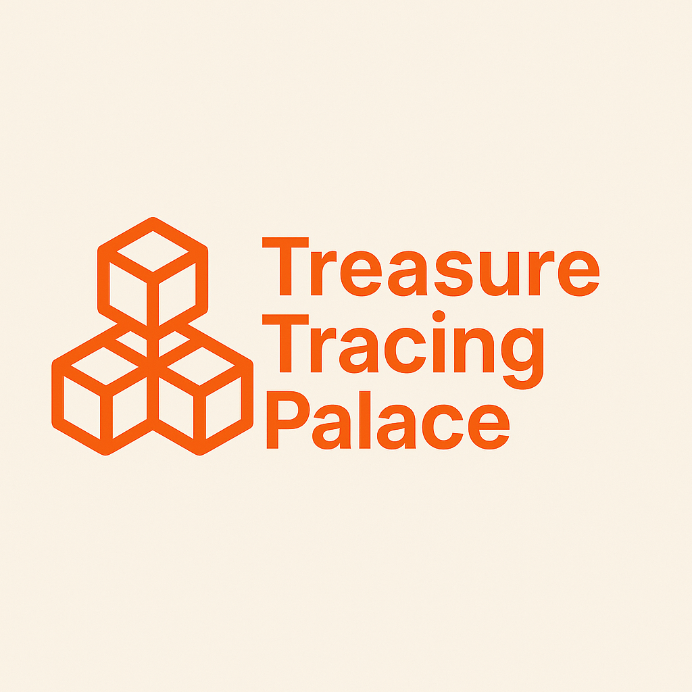

<!-- Improved compatibility of back to top link: See: https://github.com/jingjiezhou2021/treasure-tracing-palace/pull/73 -->
<a id="readme-top"></a>
<!--
*** Thanks for checking out the treasure-tracing-palace. If you have a suggestion
*** that would make this better, please fork the repo and create a pull request
*** or simply open an issue with the tag "enhancement".
*** Don't forget to give the project a star!
*** Thanks again! Now go create something AMAZING! :D
-->


<!-- PROJECT SHIELDS -->
<!--
*** I'm using markdown "reference style" links for readability.
*** Reference links are enclosed in brackets [ ] instead of parentheses ( ).
*** See the bottom of this document for the declaration of the reference variables
*** for contributors-url, forks-url, etc. This is an optional, concise syntax you may use.
*** https://www.markdownguide.org/basic-syntax/#reference-style-links
-->
[![Contributors][contributors-shield]][contributors-url]
[![Forks][forks-shield]][forks-url]
[![Stargazers][stars-shield]][stars-url]
[![Issues][issues-shield]][issues-url]
[![Unlicense License][license-shield]][license-url]


<!-- PROJECT LOGO -->
<br />
<div align="center">
  <a href="https://github.com/jingjiezhou2021/treasure-tracing-palace">
    
  </a>

  <h3 align="center">溯宝阁</h3>

  <p align="center">
    基于以太坊的去中心化商品销售和追溯平台
    <br />
    <a href="https://github.com/jingjiezhou2021/treasure-tracing-palace"><strong>浏览演示网址 »</strong></a>
    <br />
    <br />
    <a href="https://github.com/jingjiezhou2021/treasure-tracing-palace/issues/new?labels=bug&template=bug-report---.md">问题反馈</a>
    &middot;
    <a href="https://github.com/jingjiezhou2021/treasure-tracing-palace/issues/new?labels=enhancement&template=feature-request---.md">提交代码</a>
  </p>
</div>


<h2>目录</h2>

- [关于项目](#关于项目)
  - [功能模块](#功能模块)
  - [功能架构](#功能架构)
- [技术路线](#技术路线)
  - [开发工具](#开发工具)
  - [技术架构](#技术架构)
- [快速开始](#快速开始)
  - [安装](#安装)
- [贡献代码](#贡献代码)
  - [贡献者](#贡献者)


<!-- ABOUT THE PROJECT -->
# 关于项目


溯宝阁是一个去中心化的供应链管理系统，让您能够高效便捷地管理产品分销链。这有助于防止假冒产品流入市场。这对于追踪药品和品牌产品尤为有用。

它从制造商在系统注册产品的根层级开始。产品上市后，会以预先设定的价格出售给零售商。之后，消费者可以从零售商处购买该产品。所有这些交易都记录在区块链上，这使得产品流通更加透明。产品的完整历史记录也会向用户展示，用户可以看到产品自生产以来的流通过程。

本平台使用泰达币（USDT）作为支付工具。

## 功能模块

## 功能架构


<p align="right">(<a href="#readme-top">back to top</a>)</p>


# 技术路线

## 开发工具

* [](#)
* [](#)
* [](#)
* [](#)
* [](#)
* [](#)
* [](#)
* [](#)
* [](#)
* [](#)
* [](#)
* [](#)
* [](#)
* [](#)
* [](#)
* [](#)
* [](#)

## 技术架构


<p align="right">(<a href="#readme-top">back to top</a>)</p>


<!-- GETTING STARTED -->
# 快速开始

这是一个关于如何在本地设置项目的示例说明。

要在本地复制并运行，请按照以下简单示例步骤操作。


## 安装

_Below is an example of how you can instruct your audience on installing and setting up your app. This template doesn't rely on any external dependencies or services._

1. Get a free API Key at [https://example.com](https://example.com)
2. Clone the repo
   ```sh
   git clone https://github.com/github_username/repo_name.git
   ```
3. Install NPM packages
   ```sh
   npm install
   ```
4. Enter your API in `config.js`
   ```js
   const API_KEY = 'ENTER YOUR API';
   ```
5. Change git remote url to avoid accidental pushes to base project
   ```sh
   git remote set-url origin github_username/repo_name
   git remote -v # confirm the changes
   ```

<p align="right">(<a href="#readme-top">back to top</a>)</p>


<!-- CONTRIBUTING -->
# 贡献代码

正是贡献代码让开源社区成为学习、启发和创造的绝佳场所。我们非常感谢您的任何贡献。

如果您有任何改进建议，请 fork 该仓库并创建拉取请求。您也可以直接提交带有“增强”标签的 issue。
别忘了给项目点个星！再次感谢！

1. fork 项目
2. 创建您的 Feature 分支（`git checkout -b feature/AmazingFeature`）
3. 提交您的更改（`git commit -m 'Add some AmazingFeature'`）
4. 推送到分支（`git push origin feature/AmazingFeature`）
5. 创建拉取请求

## 贡献者

<a href="https://github.com/jingjiezhou2021/treasure-tracing-palace/graphs/contributors">
  
</a>

<p align="right">(<a href="#readme-top">back to top</a>)</p>


<!-- MARKDOWN LINKS & IMAGES -->
<!-- https://www.markdownguide.org/basic-syntax/#reference-style-links -->
[contributors-shield]: https://img.shields.io/github/contributors/jingjiezhou2021/treasure-tracing-palace.svg?style=for-the-badge
[contributors-url]: https://github.com/jingjiezhou2021/treasure-tracing-palace/graphs/contributors
[forks-shield]: https://img.shields.io/github/forks/jingjiezhou2021/treasure-tracing-palace.svg?style=for-the-badge
[forks-url]: https://github.com/jingjiezhou2021/treasure-tracing-palace/network/members
[stars-shield]: https://img.shields.io/github/stars/jingjiezhou2021/treasure-tracing-palace.svg?style=for-the-badge
[stars-url]: https://github.com/jingjiezhou2021/treasure-tracing-palace/stargazers
[issues-shield]: https://img.shields.io/github/issues/jingjiezhou2021/treasure-tracing-palace.svg?style=for-the-badge
[issues-url]: https://github.com/jingjiezhou2021/treasure-tracing-palace/issues
[license-shield]: https://img.shields.io/github/license/jingjiezhou2021/treasure-tracing-palace.svg?style=for-the-badge
[license-url]: https://github.com/jingjiezhou2021/treasure-tracing-palace/blob/master/LICENSE.txt
[linkedin-shield]: https://img.shields.io/badge/-LinkedIn-black.svg?style=for-the-badge&logo=linkedin&colorB=555
[linkedin-url]: https://linkedin.com/in/jingjiezhou2021
[product-screenshot]: images/screenshot.png
[Next.js]: https://img.shields.io/badge/next.js-000000?style=for-the-badge&logo=nextdotjs&logoColor=white
[Next-url]: https://nextjs.org/
[React.js]: https://img.shields.io/badge/React-20232A?style=for-the-badge&logo=react&logoColor=61DAFB
[React-url]: https://reactjs.org/
[Vue.js]: https://img.shields.io/badge/Vue.js-35495E?style=for-the-badge&logo=vuedotjs&logoColor=4FC08D
[Vue-url]: https://vuejs.org/
[Angular.io]: https://img.shields.io/badge/Angular-DD0031?style=for-the-badge&logo=angular&logoColor=white
[Angular-url]: https://angular.io/
[Svelte.dev]: https://img.shields.io/badge/Svelte-4A4A55?style=for-the-badge&logo=svelte&logoColor=FF3E00
[Svelte-url]: https://svelte.dev/
[Laravel.com]: https://img.shields.io/badge/Laravel-FF2D20?style=for-the-badge&logo=laravel&logoColor=white
[Laravel-url]: https://laravel.com
[Bootstrap.com]: https://img.shields.io/badge/Bootstrap-563D7C?style=for-the-badge&logo=bootstrap&logoColor=white
[Bootstrap-url]: https://getbootstrap.com
[JQuery.com]: https://img.shields.io/badge/jQuery-0769AD?style=for-the-badge&logo=jquery&logoColor=white
[JQuery-url]: https://jquery.com 